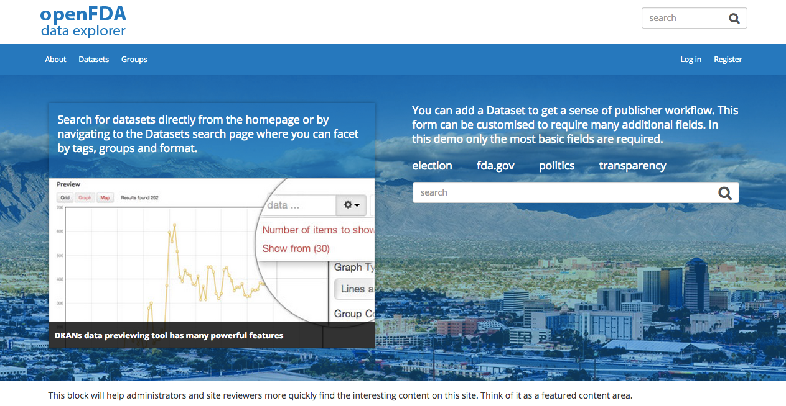
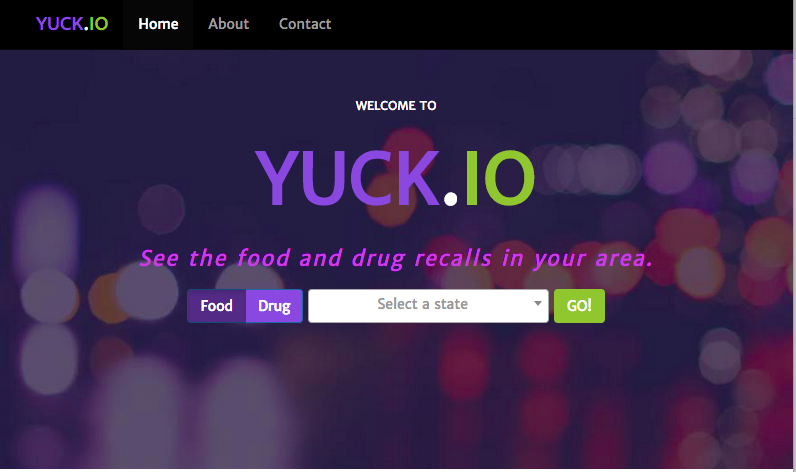

#Knowledge Facilitation Group#
##Response to RFQ993471##

[](http://www.youtube.com/watch?v=f4IEkTLi4hg "KFG Video Walkthrough")

**Visit our demo sites** 

* [Drupal Dataset Publication Platform](http://openfda.kfgisit.com "Drupal Dataset"), our dataset publishing platform 

* [Yuck.io](http://yuckio.kfgisit.com "Yuck.io Demo Site"), Our rapid demo of "Food and Drug Enforcement Where **You** Live"

#Description#

Thank you for evaluating this work in response to the RFQ. Given the aggressive timeline of the RFQ, our project heavily leverages opensource componentry. Given the language in the RFQ and the tone of reduce, reuse, recycle we thought it would be appropriate to show how we would approach the problem and leverage the combination of several open source packages working in concert to solve a problem. For our project, we elected to build a "dataset explorer" website and we used Drupal as a basis for that project. We have extended the Drupal installation profile with the ability to directly import JSON feeds from the openFDA, and have provided two example datasets with both "low-fidelity" and "high-fidelity" functionality. From [the main home page](http://openfda.kfgisit.com) these datasets are accessible by clicking on openFDA datasets and then either the Yuck.IO dataset, or the Top Adverse Reactions dataset. While the demonstration datasets are functional in a stand-alone fashion, the main "dataset explorer" brings the projects together and is meant to function similar to the dataset exploration functionality of data.gov. 

Please note that we normally use a non-public git-based version control system, [Phabricator](http://phabricator.org/ "Phabricator") with our project workflow process for clients. While we love GitHub, usually our clients are not comfortable using public repos for their projects. 

Our response to the RFQ is divided into two pieces: 

1.	[openFDA Drupal Dataset Publication Platform 
](http://openfda.kfgisit.com "Drupal Dataset Front End")
A Drupal-based website that essentially a “dataset publishing platform” (similar to data.gov.uk) that is capable of cataloging, graphing and displaying many generic datasets (including GeoJSON, CSV and others). The Drupal Dataset Publication Platform is based on PHP, Drupal & Angular/JavaScript.
 
2. [Yuck.io 
](http://yuckio.kfgisit.com)
A sample scenario-specific front-end, titled “Yuck.io” which is a website that finds food and drug recalls in your state. The Yuck.io site is based on Python, Django, Bootstrap, & jQuery/JavaScript. 

##Systems Engineering##

###Getting Up And Running###
Start by checking out this repository. You can then use the Dockerfiles to build containers for both Yuck.io, a Django and Bootstrap based website that allows you to explore Food and Drug recalls in your home state; and openFDA Explorer, a Drupal-based site that allows users to explore datasets and admins to easily add new curated datasets from openFDA and other sources. The docker files will bootstrap a starter database from the installation profile to make the environment setup rapid. 

```bash
# docker build -t bpademo/drupal  -f Dockerfile  .
# docker run -d -p 80:8000 [image id]
```
          
Build a container that contains the “Yuck.io” project 

```bash
# docker build -t bpademo/yuckio  -f Dockerfile-yuckio  .          
# docker run -d -p 81:8000 [image id]     
```
TODO: Example docker files in docker hub see the security file.
       
You can learn more about what’s involved with setting these sites up by reading the Docker files associated with each project because they contain comments, or the system engineering section of the [Yuck.io README file](https://github.com/KFGisIT/gsa-bpa-django/blob/master/README.md) and the [Drupal Dataset Publication README file](https://github.com/KFGisIT/gsa-bpa-drupal/blob/master/README.md). This repository also contains helper scripts called by and explained further in the Docker files’ comments. 

For simplicity of communication, we have opted not to use fig/compose for this demonstration, which would be more appropriate for support of multi-container applications.

###Hosting/Servers###
The demonstration URLs are hosted on our development environment. However, they are ordinary docker containers and have been tested to be compatible with [Machine] (https://docs.docker.com/machine/), a tool that helps containers run in Amazon AWS, Digital Ocean, etc. These projects are currently hosted internally, however, we have experience deploying this in Amazon’s FedRAMP cloud space, too. 

###Security###
Default deployment on Docker represent some key security concerns, especially in the database, application, and provisioning layers. For details about these vulnerabilities and how KFG has resolved them, please see [Security.md](./Security.md)

##Background##

The Drupal Dataset Publishing Platform is an entire dataset publishing platform. It is a similar concept to data.gov.uk and can syndicate many different kinds of datasets including CSV, JSON, GeoJSON and more. The site has several example datasets, and more can be created and published for anonymous public consumption through the backend GUI on the site. 
This type of project scales very well to large teams because it can be worked on in parallel by several different teams. This is because we leverage continuous integration and automation to easily provide teams with access to their own sandboxes by leveraging Docker automation to orchestrate automation of the underlying technologies to quickly create a turn-key Drupal-based Dataset Publishing platform. 

The OpenFDA Data Explorer Drupal platform provides a convenient architecture for developing with large teams: theming, logic, data controls/permission-based workflow and site data can all be managed independently. Additionally, not all development teams need to have access to production data. Many teams can work from an installation profile such as these and then work with integration specialists to deploy changes to the "gold master" production images. This lends significant scalability. 

The “Yuck.io” site is a completely original project that is meant to demonstrate a “high-fidelity” front-end project that re-uses technology our teams are familiar with under the hood, and incorporates technologies mentioned in RFQ. It is a site that could be used by anonymous public visitors to query food and drug recalls in their state. The dataset is delivered via JSONP queries to the FDA’s JSON API. It was also something our designers and copywriters could have a hand in contributing to because it is an original work. With a new food recall or illness story on the news seemingly every day, more people are looking to the government, specifically the FDA, to make sure their families are safe. This natural reaction to news stories is the concept behind the site. Yuck.io is a new web application that pulls FDA's enforcement information for the general public to view recent enforcement activity related to food and drugs. 

#Approach#

To address the modern enterprise and in line with our user story of a highly mobile user community, we chose to employ the Twitter Bootstrap Responsive Design Framework based in HTML5, CSS3, and jQuery. This allows our design to flex for devices across the mobile (phone/tablet) and desktop platforms. 

To test our work, rather than modeling individual testers and test plans, we make use of automated testing via the Python Selenium framework. This allows us to make assertions about the user experience and implement true test-driven agile development from the functional level as well as the unit testing level. These tests are all committed into the project repository and allow for future extensibility with full regression testing capabilities.

To accomplish this, we broke the project down into three phases. Each phase employs interactive feedback between the designers, developers & engineers to create and deploy the prototype.

1.	Design
2. 	Development
3. 	Deployment

##Design Process##

All KFG applications are designed from a user-centric approach emphasizing the agile principle of user based software design and what people need through the prototype design. This user story is encapsulated [here](https://github.com/KFGisIT/gsa-bpa-django/blob/master/README.md), and is designed to the needs of our hypothetical customer.

###Tools & Techniques###

To most effectively communicate design, we take a human focus rolling through several key tools and processes. This typically takes the form of:

1.	Framework for Structural Design and Rapid Storyboarding (Balsamiq)
*	Page Mockups (Adobe Photoshop)
* 	Vector Art as Necessary (Adobe Illustrator) 
*	Final Presentation to Client (Adobe InDesign)

###Style Guide###
KFG follows a mobile ready format design that allows us to immediately leverage a [bootstrap](http://getbootstrap.com/css/#grid)-like format.

*	12 column layout
* 	Responsive Design Focus
*  User Usability First
*  508 Compliance

##Continous Integration & Automated Testing

In any project Continuous integration & automated testing are key parts of any KFG agile methodology; we leverage many technologies including: 

*	[Travis-CI](https://travis-ci.org/) 
*	[phpUnit](https://phpunit.de/pyunit) / [pyUnit](http://pyunit.sourceforge.net/)
* 	[Selenium](http://www.seleniumhq.org/) 

For more info on testing and automation frameworks, please see [Automation.md](Automation.md).

##Usability Testing###
KFG preformed usability testing with both internal testing staff and an external focus group mixed between different browsers and platforms to test both desktop and mobile platforms 

*	Mac & PC using Chrome, Firefox, Safari, Firefox & IE
* 	iOS
*  Android

#Licences#
This product is licensed under the [MIT license agreement](./LICENSE.md "License")

#Credits#
*  	Krista Diamond, Visual Designer
*	Amanda Furman, Product Manager
* 	Daniel Furman, Technical Architect
*	Paul Makarov, Frontend & Backend Web Developer
* 	Wendell Wilson, DevOps Engineer
*  	Ryan Elliott, Backend
*  	Jeff Edwards, Frontend, Copywriter, UX, Validation, Drupal View Dude
*  	Miles Briggs, Frontend Integration
*	Wade Simmons, Frontend (Middleware)
