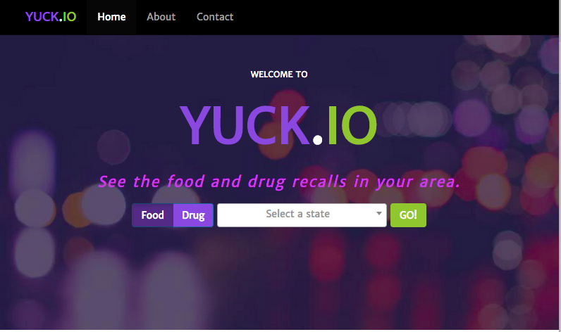

#Yuck.io#



Visit the [demo site](http://yuckio.kfgisit.com "demo site")! 

Food and Drug Enforcement Where *You* Live

##Description##
Employing an Agile methodology, we needed to begin with a user story. Our team drew inspiration from the enforcement feeds available from the provided FDA API in the food and drug areas.

Referencing the user story, the team created a backlog of features, allowing for 

[750 word description of the approach used to create the working prototype]

1. Drupal
2. Django

Thank you for evaluating this work in response to the RFQ. Given the aggressive timeline of the RFP, we decided to approach the problem by recycling work from past projects based on open source componentry. Given the language in the RFP and the tone of reduce, reuse, recycle we thought it would be appropriate to show how we would approach the problem and leverage the combination of several open source packages working in concert to solve a problem.

Please note that we normally use a non-public git-based version control system, Phabricator (http://phabricator.org/) with our project workflow process for clients. While we love GitHub, usually our clients are not comfortable using public repos for their projects. 
Our response to the RFP is divided into two pieces: A Drupal-based website that essentially a “dataset publishing platform” (similar to data.gov.uk) that is capable of cataloging, graphing and displaying many generic datasets (including GeoJSON, CSV and others); and a sample scenario-specific front-end, titled “Yuck.io” which is a website that finds food and drug recalls in your state. The “Yuck.io” site is based on Bootstrap, Django. 

Drupal Dataset Frontend Site: bpadatasets.kfgisit.com
“Yuck.io” – Find Food and Drug Recalls in your state – yuckio.kfgisit.com 

Up And Running
Build a container that contains Drupal and the starter database from the installation profile. 

```bash
# docker build -t bpademo/drupal  -f Dockerfile  .
# docker run -d -p 80:8000 [image id]
```
          
Build a container that contains the “Yuck.io” project 

```bash
# docker build -t bpademo/yuckio  -f Dockerfile-yuckio  .          
# docker run -d -p 81:8000 [image id]     
```
       
You can learn more about what’s involved with setting these sites up by reading the Dockerfiles associated with each project because they contain comments. This repository also contains helper scripts called by and explained further in the Dockerfiles’ comments. 
For simplicity of communication, we have opted not to use fig/compose for this demonstration (which would better support multi-container applications). 

Hosting/Servers
The demonstration URLs are hosted on our development machines. However, they are ordinary docker containers and have been tested to be compatible with Machine (https://docs.docker.com/machine/), a tool that helps containers run in Amazon AWS, Digital Ocean, etc. We have experience deploying this in Amazon’s FedRAMP cloud space, too. 

Background

The “Yuck.io” site is a completely original project that is meant to demonstrate a “high-fidelity” front-end project that re-uses technology our teams are familiar with under the hood, and incorporates technologies mentioned in RFP. It is a site that could be used by anonymous public visitors to query food and drug recalls in their state. The dataset is delivered via JSONP queries to the FDA’s JSON API. It was also something our designers and copywriters could have a hand in contributing to because it is an original work. 
The Drupal Dataset Publishing Platform is an entire dataset publishing platform. It is a similar concept to data.gov.uk and can syndicate many different kinds of datasets including CSV, JSON, GeoJSON and more. The site has several example datasets, and more can be created and published for anonymous public consumption through the backend GUI on the site. 
This type of project scales very well to large teams because it can be worked on in parallel by several different teams. This is because we leverage continuous integration and automation to easily provide teams with access to their own sandboxes by leveraging Docker automation to orchestrate automation of the underlying technologies to quickly create a turn-key Drupal-based Dataset Publishing platform. 

 [DIAGRAM HERE SHOWING HOW MODULES/THEMES CAN BE CLONED WITH GIT IN THE DOCKERFILE OR CAN MAKE THEIR WAY INTO THE INSTALL PROFILE?] 
 
In such a workflow, continuous integration and testing is important. As such, for this Drupal project, which is based on PHP, we leverage Travis (https://travis-ci.org), Selenium (http://www.seleniumhq.org/), and PHPUnit (https://phpunit.de/) for Unit Testing.  
##Background##
With a new food recall or illness story on the news seemingly every day, more people are looking to the government, specifically the FDA, to make sure their families are safe. This natural reaction to news stories is the concept behind yuck.io

Yuck.io is a new web application that pulls FDA's enforcement information for the general public to view recent enforcement activity related to food and drugs.

#Approach#

To address the modern enterprise and in line with our user story of a highly mobile user community, we chose to employ the Twitter Bootstrap Responsive Design Framework based in HTML5, CSS3, and jQuery. This allows our design to flex for devices across the mobile (phone/tablet) and desktop platforms. 

To test our work, rather than modeling individal testers and test plans, we make use of automated testing via the Python Selenium framework. This allows us to make assertions about the user experience and implement true test-driven agile development from the functional level as well as the unit testing level. These tests are all committed into the project repository and allow for future extensibiliy with full regression tesing capabilites.

To accomplish this, we broke the project down into three phases. Each phase employs interactive feedback between the designers, developers & engineers to create and deploy the prototype.

1.	Design
2. 	Development
3. 	Deployment

[Used an interactive approach-feedback informed subsequent work or versions of the prototype]

##Design Process##
***asked Krista***

[Understand what 'people' need, by including people in the prototype design process]

[Used at least 3 'human-centered design' tools and techniques]

[Created or used a design style guide or a pattern library]

##Architecture##
*	Linux-Apache-Python Server Stack
*	Docker
*	HTML5
* 	CSS3
*	Python 3.3.*
*	Django 1.7.*
*	Selenium 2.46.*
*	JavaScript 
*	jQuery 2.1.4
* 	Bootstrap 3.3.*
* 	Bower 0.1.0
*	Npm 2.10.1
*	Pip 7.0.3

##Systems Engineering##
	
###Configuration Management###

**Installation**

Based in Python3 & Django's web framework, getting Yuck.io up and running couldn't be easier.

*Install Prerequisites*

**Python Requirements**

```bash
$ pip install -r requirements.txt
```

**Node Requirements**

```bash
$ npm install -g bower
```

*Clone the Yuck.io Repository*

```bash
$ git clone git@github.com:KFGisIT/gsa-bpa-django.git
```

*Pull Dependencies*

```bash
$ cd gsa-bpa-django
$ bower install
```

*Setup Apache to Serve Django*

```apacheconf
WSGIScriptAlias / /path/to/gsa-bpa-django/app/wsgi.py
WSGIPythonPath /path/to/gsa-bpa-django

<Directory /path/to/gsa-bpa-django/app> 
<Files wsgi.py>
Require all granted
</Files>
</Directory>
```

*Docker Container*

[Reference to the DockerFile]

##Deployment##
***ask wendell***

[IaaS or PaaS- list provider]

*	Docker based
* 	works on anything

[Performed usability tests with people]

[Continuous Monitoring]
[Continuous Integration]
Travis as Build System
**Dan to Add Stuff**

-Git webhook 

-Git webhook kicks off Travis job for testing, autostaging docker files & report back via email or travis

-Drupal part = CKAN data warehouse, Drupal FE, Drupal Modules for Integration (Data API), FE to huge dataset, which is a wide data set

-Example Application = Yuck.io in Django, small scope site

#Licences#
This product is licensed under the [MIT license agreement](./License.md "License")

#Credits#
*  	Krista Diamond, Visual Designer
*	Amanda Furman, Product Manager
* 	Daniel Furman, Technical Architect
*	Paul Makarov, Frontend & Backend Web Developer
* 	Wendell Wilson, DevOps Engineer
*  	Ryan Elliott, Backend
*  	Jeff Edwards, Frontend, Copywriter, UX, Validation, Drupal View Dude
*  	Miles Briggs, Frontend Integration
*	Wade Simmons, Frontend (Middleware)

#Yuck.io User Story#
##Melanie - The Soccer Mom Down the Street##
###Background###
Melanie and George live in Everytown, USA with their three kids George, Jr., Brittany, and Brendan. She drives a late model mini-van, spends her evenings/weekends on her kids' soccer, and relaxes each night watching the evening news. She worries about her family's health and carefully watches what her kids and husband eat.
###Interview with Melanie###


The kids all keep me hopping with three different soccer practice schedules, matches, tournaments and scrimmages. 
Since we live in the tri-state area; and with the schedules of George Jr & Brittany, we're *always* crossing states lines for games. 

After the PTA meeting last week, a few of us were talking about the latest food recall, 
and I mentioned how worried I was about the food we eat and how much time it took going through recall notices to see if our area was affected. 
One of my friends 
told that she just started using a new website to check government postings for food enforcement action for our area and wherever they traveled.

I immediately pulled out my phone and bookmarked the site. 
I had always been nervous about food recalls when we're traveling, and this seems like the solution :)
All I have to do is punch in the state where I am and I can see a list of all of the recalls in the area! It's amazing.

One of the things that struck me is how cute the site is. 
The design makes it easy to see information where I am, or where my parents live out of state, or wherever we happen to be traveling, and understand what I'm seeing. 
It even makes it easier to read. 
These recalls can be seriously depressing to pour over, and somehow it seems much more friendly now.
 
I was happy to see that I can check the same kind of information for pharmacies and drug recalls in the area. 
The kids always seem to be getting hurt, and after a 3 hour drive with the kids and four hours of games, I need a few tylenol.
I never even thought about checking the recalls on them before, now I can't imagine going into a corner pharmacy without looking at Yuck.io first.

Now that I know I can just click a switch, I've been spending more time on the site in the last month to make sure none of George's heart medicine is on the yuck-list.
At first he called me paranoid for always checking the site, but lately he's even on it at work to make sure none of the medicine he uses at his dental practices is showing up on the yuck-list.

Since the other local moms and I stay in touch on facebook and I've been getting more twitter followers from the school, 
I really like the simple way to post a yuck from the yuck-list to my wall or tweet a yuck to get the word out.
